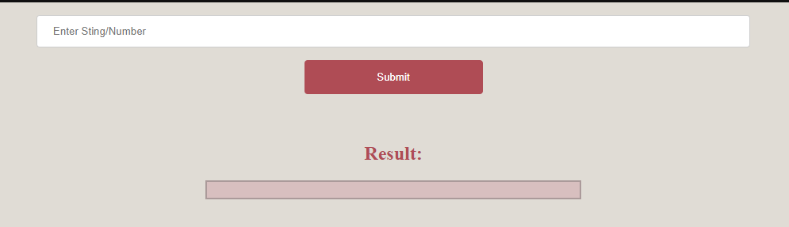
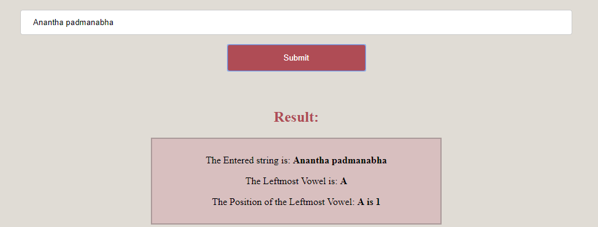
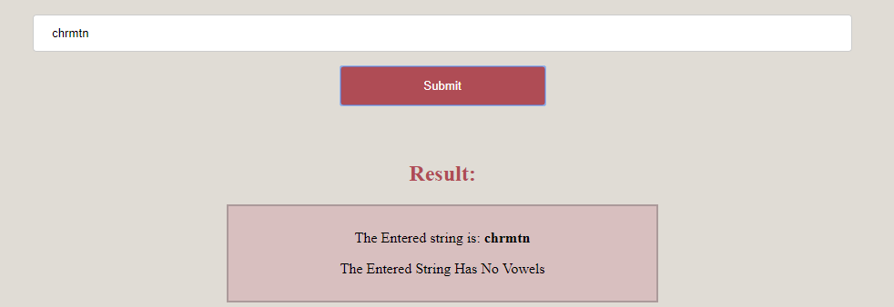
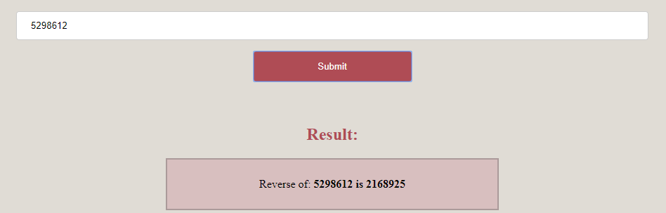

# VTU-Web-Lab-program-4
 HTML5 file that includes JavaScript script that uses functions for the following problems: a. Parameter: A string b. Output: The position in the string of the left-most vowel c. Parameter: A number d. Output: The number with its digits in the reverse order
## Screenshot

